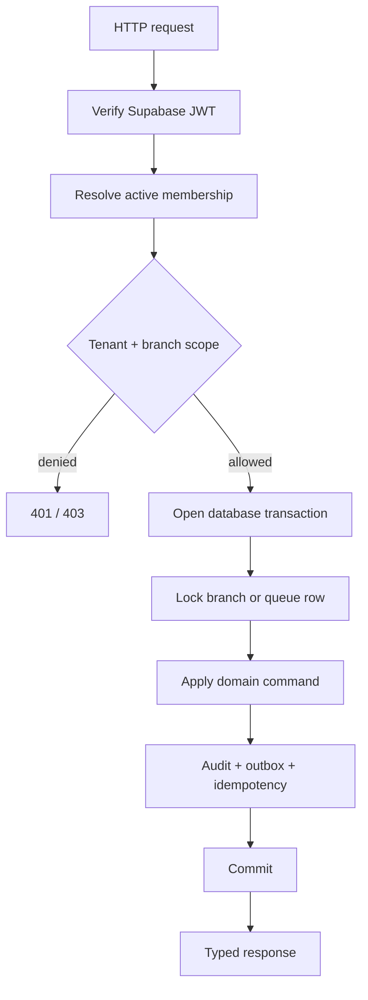

# MediQueue Backend

> The typed, tenant-scoped FastAPI service behind MediQueue.

[](https://fastapi.tiangolo.com/)
[](https://github.com/ChamathDilshanC/mediqueue-backend)
[](https://mediqueue-backend-eta.vercel.app/docs)

The backend owns identity integration, hospital and branch management,
memberships, scheduling, patients, appointments, visits, queues, audit events,
outbox events, and the public configuration endpoint.

## API surface

| Area | Capabilities |
| --- | --- |
| Identity | Register, login, refresh, logout, recovery, current profile |
| Hospitals | Onboarding, branches, departments, rooms, doctors |
| Access | Memberships, roles, tenant scope, branch scope |
| Scheduling | Timezone-aware schedules, capacity, overlap prevention |
| Patient flow | Patients, appointments, visits, queue setup |
| Queue | Check-in, snapshot, call-next, token transitions |
| Reliability | Idempotency, row locks, audit trail, PostgreSQL outbox |
| Operations | `/health`, `/health/ready`, `/status`, `/v1/config/public` |

## Request flow



## Local setup

```powershell
python -m pip install -e '.[test]'
Copy-Item .env.example .env
python -m backend.init_db
python -m uvicorn backend.main:app --reload
```

The SQLite initializer is for development only. Production uses PostgreSQL
with Alembic:

```powershell
python -m alembic upgrade head
```

## Environment

Required production settings include:

```text
DATABASE_URL=postgresql://postgres.<project-ref>:PASSWORD@aws-0-<region>.pooler.supabase.com:5432/postgres?sslmode=require
SUPABASE_URL=https://<project-ref>.supabase.co
SUPABASE_ANON_KEY=<public-anon-key>
SUPABASE_JWKS_URL=https://<project-ref>.supabase.co/auth/v1/.well-known/jwks.json
CONFIG_PATH=configuration/defaults.json
```

Use the Supabase Session Pooler on port `5432` for Vercel. Encode password
characters (`@` → `%40`, `#` → `%23`, `%` → `%25`). Never commit `.env`,
database passwords, service-role keys, or OAuth secrets.

## Documentation and deployment

- Local portal: <http://127.0.0.1:8000/docs>
- Live portal: <https://mediqueue-backend-eta.vercel.app/docs>
- Swagger: `/swagger`
- ReDoc: `/redoc`
- OpenAPI: `/openapi.json`

Vercel deploys `backend.main:app`. Set Production environment variables in the
`mediqueue-backend` Vercel project, then create a new deployment after every
environment change. Verify:

```powershell
Invoke-RestMethod https://mediqueue-backend-eta.vercel.app/health
Invoke-RestMethod https://mediqueue-backend-eta.vercel.app/health/ready
```

## Testing

```powershell
python -m pytest -q
```

The suite covers API behavior, state transitions, tenant isolation, idempotent
commands, and database-backed concurrency paths where PostgreSQL is configured.

## Repository boundaries

- `backend/` — application package
- `alembic/` — owned schema migrations
- `tests/` — unit and integration tests
- `worker/` — outbox processing entry points
- `backend/static/` — branded documentation portal assets

See the [main repository](https://github.com/ChamathDilshanC/mediqueue) for the
system diagram and [architecture notes](../docs/architecture.md) for ownership
and rollout decisions.
