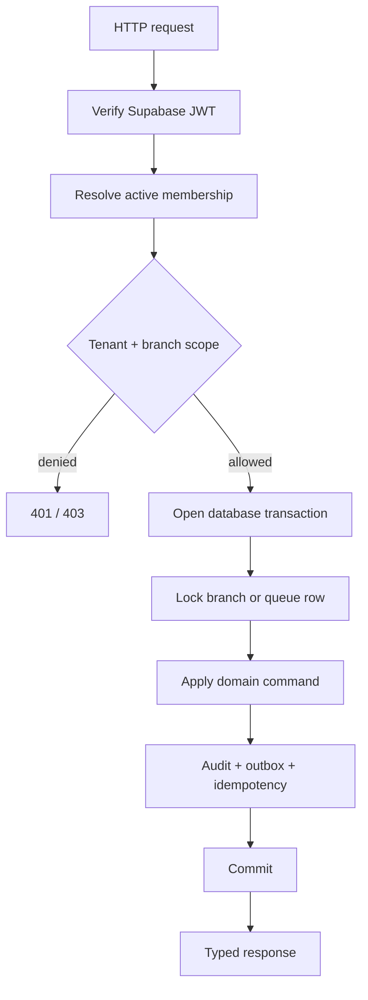

# MediQueue Backend

Patient appointment requests enter `PENDING`. The branch-scoped
`GET /v1/appointment-inbox` supports status/search filters, pagination and counts.
Admin, staff and reception can approve, reject with a reason, record arrival or
absence, complete and cancel through `PATCH /v1/appointments/{id}`. Decision
metadata is stored and audited; patients see their updated status and rejection
reason. Apply Alembic revision `0010_appointment_review` before deployment.
Existing bookings retain `BOOKED`, shown as Approved; staff bookings remain approved.

Patient discovery is available at `/v1/patient/centers`; branch admins configure
public address, phone and paired latitude/longitude through the branch API.
`/v1/patient/schedules/{branch_id}` includes remaining session capacity and the
caller's booking state. `/v1/patient/queue-status/{branch_id}` returns sanitized
queue counts and approximate waits; owned ticket summaries include individual
estimates. At least three measured recent service durations select a median;
otherwise `average_service_minutes` (configurable per queue, default 5) is used.
Apply Alembic revision `0009_patient_discovery` before deploying this feature.
Existing local SQLite sidecars receive these additive columns on initialization
or startup without dropping stored data.

> The typed, tenant-scoped FastAPI service behind MediQueue.

[](https://fastapi.tiangolo.com/)
[](https://github.com/ChamathDilshanC/mediqueue-backend)
[](https://mediqueue-backend-eta.vercel.app/docs)

The backend owns identity integration, hospital and branch management,
memberships, scheduling, patients, appointments, visits, queues, audit events,
outbox events, and the public configuration endpoint.

## API surface

| Area | Capabilities |
| --- | --- |
| Identity | Register, login, refresh, logout, recovery, current profile |
| Hospitals | Onboarding, branches, departments, rooms, doctors |
| Access | Memberships, roles, tenant scope, branch scope |
| Scheduling | Timezone-aware schedules, capacity, overlap prevention |
| Patient flow | Patients, appointments, visits, queue setup |
| Queue | Check-in, snapshot, call-next, token transitions |
| Reliability | Idempotency, row locks, audit trail, PostgreSQL outbox |
| Operations | `/health`, `/health/ready`, `/status`, `/v1/config/public` |

## Request flow



## Local setup

```powershell
python -m pip install -e '.[test]'
Copy-Item .env.example .env
python -m backend.init_db
python -m uvicorn backend.main:app --reload
```

The SQLite initializer is for development only. Production uses PostgreSQL
with Alembic:

```powershell
python -m alembic upgrade head
```

## Environment

Required production settings include:

```text
DATABASE_URL=postgresql://postgres.<project-ref>:PASSWORD@aws-0-<region>.pooler.supabase.com:5432/postgres?sslmode=require
SUPABASE_URL=https://<project-ref>.supabase.co
SUPABASE_ANON_KEY=<public-anon-key>
SUPABASE_JWKS_URL=https://<project-ref>.supabase.co/auth/v1/.well-known/jwks.json
STRIPE_SECRET_KEY=<server-only-stripe-secret-key>
STRIPE_SUCCESS_URL=https://<frontend-origin>/patient?payment=success
STRIPE_CANCEL_URL=https://<frontend-origin>/patient?payment=cancelled
CONFIG_PATH=configuration/defaults.json
```

When creating a doctor, hospital staff can optionally save a default quotation
template using one item per line in the form `name | amount` (for example,
`Consultation fee | 2500`). New appointments for that doctor copy this template
automatically, while staff can still edit the final quotation from the
appointment inbox. Patients can then choose Stripe Checkout or pay at the
hospital from their appointment card.
Keep `STRIPE_SECRET_KEY` server-side; online payment is unavailable until it is set.

Use the Supabase Session Pooler on port `5432` for Vercel. Encode password
characters (`@` → `%40`, `#` → `%23`, `%` → `%25`). Never commit `.env`,
database passwords, service-role keys, or OAuth secrets.

## Documentation and deployment

### Release 0017: payment integrity and schema ownership

- Run `python -m alembic upgrade head` (revision `0017_payment_integrity`) before
  deploying. The API no longer changes the PostgreSQL schema at startup;
  `/health/ready` returns 503 until the database is at the expected revision.
- Set `SYSTEM_ADMIN_EMAILS` in Vercel. Hospital review endpoints and
  `POST /v1/hospitals` accept only these confirmed emails; other users apply via
  `POST /v1/hospital-applications`.
- Stripe payments are bound to one Checkout Session and its amount. A payment that
  does not match the current quotation becomes `REVIEW_REQUIRED`; money for a
  cancelled/rejected appointment becomes `REFUND_REQUIRED`. Staff settle both with
  `POST /v1/appointments/{id}/payment-resolution` (`REFUND` or `ACCEPT`).
- `DELETE /v1/appointments/{id}` now cancels and retains the appointment.

- Local portal: <http://127.0.0.1:8000/docs>
- Live portal: <https://mediqueue-backend-eta.vercel.app/docs>
- Swagger: `/swagger`
- ReDoc: `/redoc`
- OpenAPI: `/openapi.json`

Vercel deploys `backend.main:app`. Set Production environment variables in the
`mediqueue-backend` Vercel project, then create a new deployment after every
environment change. Vercel does not run Alembic migrations as part of the
Python function build, so run the migration against the production database
before deploying API changes that add tables:

```powershell
python -m alembic upgrade head
```

In particular, organization registration requires migration
`0003_organization_applications`; without it, `POST /v1/hospital-applications`
will fail because the application table does not exist. Verify:

```powershell
Invoke-RestMethod https://mediqueue-backend-eta.vercel.app/health
Invoke-RestMethod https://mediqueue-backend-eta.vercel.app/health/ready
```

## Testing

```powershell
python -m pytest -q
```

The suite covers API behavior, state transitions, tenant isolation, idempotent
commands, and database-backed concurrency paths where PostgreSQL is configured.

## Repository boundaries

- `backend/` — application package
- `alembic/` — owned schema migrations
- `tests/` — unit and integration tests
- `worker/` — outbox processing entry points
- `backend/static/` — branded documentation portal assets

See the [main repository](https://github.com/ChamathDilshanC/mediqueue) for the
system diagram and [architecture notes](../docs/architecture.md) for ownership
and rollout decisions.

## Hospital management and patient portal (2026-10-04)

The staff dashboard adds consultations and vital signs, prescriptions/dispensing,
lab orders/results, LKR invoices and cumulative payment recording, inventory and
staff contacts/shifts. Each record is branch-scoped, strictly validated and audited;
updates require a version and reject stale writes. Signed consultations and released
lab results are immutable. Clinical access is limited to admins/doctors; reception
can manage billing; staff can manage labs/stock and dispense unchanged prescriptions.
Invoice balances are calculated server-side and payments cannot be reduced.

`/v1/patient/*` uses the verified identity without granting a staff membership.
Patient enrollment creates an explicit identity-to-patient ownership link for one
hospital. Patients can select a center, book/cancel their own appointments, and read
only their own signed consultations, prescriptions, released results and invoices.
Existing hospital records are not automatically claimed by matching email/name.
Self-enrollment creates a new profile; linking/merging pre-existing profiles remains
an administrative integration task.

`GET /v1/reports/overview` returns exact counts, appointment status totals and
role-filtered billing/stock summaries. Ward admissions reserve beds transactionally,
reject duplicate active occupancy, and place released beds in CLEANING status.

Before deploying, run `alembic upgrade head` against PostgreSQL. Revision
`0006_management` adds patient ownership/module storage and formalizes legacy
patient/ward schema additions. For a fresh local SQLite database, run
`python -m backend.init_db`. No production migration or deployment is performed
by modifying these files. Management history is retained rather than deleted.

Inventory is an editable stock register; dispensing does not automatically decrement
stock. Billing records cumulative manual payments, not online payment processing or
a financial ledger. Insurance claims, payroll, procurement automation, PACS/device
integrations and live realtime fanout require additional integration work.
## Ward occupancy

Run `alembic upgrade head` before deploying the ward board (revision
`0007_ward_stay_dates`). Staff can fetch `/v1/wards/{ward_id}/bed-map` in their branch.
Admissions support `admitted_at` and nullable `planned_discharge_at`; allocation
timestamps are maintained by bed assignment. Day counts include admission day as
day 1 in the branch timezone and stop at actual discharge. Patient overview returns
only owned ward stays. Database errors use sanitized JSON 503 responses.

## Patient journey queues

Apply `alembic upgrade head` through `0008_patient_flow`. Configure queue
`service_type` as REGISTRATION, CONSULTATION or DISPENSARY (existing queues stay
GENERAL); consultation queues require `room_id`. Patients fetch owned tickets with
`GET /v1/patient/tickets` and take registration tickets via
`POST /v1/patient/queues/{id}/tickets` using an Idempotency-Key. Staff complete the
current station and call `POST /v1/journey/tokens/{id}/handoff` with `queue_id` and an
Idempotency-Key to issue the next ticket in the same visit. Reception can operate
and route registration tickets; patients cannot invoke staff commands.
